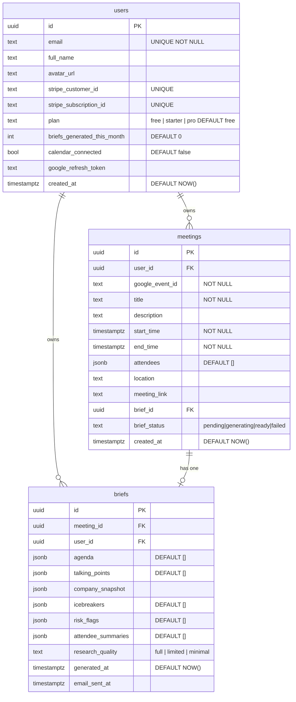

# Database Schema

MeetPrep uses **Postgres via Supabase**. Row Level Security (RLS) is enabled on all tables.

---

## Entity Relationship Diagram



---

## Table Reference

### `users`

Extends `auth.users`. Created automatically by trigger on first sign-up.

| Column | Type | Notes |
|--------|------|-------|
| `id` | uuid | FK → `auth.users.id` (CASCADE DELETE) |
| `email` | text | Unique. Synced from auth on creation |
| `full_name` | text | From OAuth metadata if available |
| `avatar_url` | text | From OAuth metadata if available |
| `stripe_customer_id` | text | Set on first Stripe checkout |
| `stripe_subscription_id` | text | Active subscription ID |
| `plan` | text | `free` / `starter` / `pro` |
| `briefs_generated_this_month` | int | Reset monthly by cron function |
| `calendar_connected` | bool | Set true after Google OAuth |
| `google_refresh_token` | text | Used to fetch calendar events server-side |
| `created_at` | timestamptz | |

### `meetings`

One row per calendar event per user. Upserted by the webhook handler.

| Column | Type | Notes |
|--------|------|-------|
| `id` | uuid | Auto-generated |
| `user_id` | uuid | FK → `users.id` |
| `google_event_id` | text | Google Calendar event ID |
| `title` | text | Meeting title |
| `description` | text | Meeting description / notes |
| `start_time` | timestamptz | |
| `end_time` | timestamptz | |
| `attendees` | jsonb | Array of `{email, name, company, linkedin_url}` |
| `location` | text | Physical location if set |
| `meeting_link` | text | Video call URL |
| `brief_id` | uuid | FK → `briefs.id` (NULL until brief is ready) |
| `brief_status` | text | `pending` → `generating` → `ready` / `failed` |
| `created_at` | timestamptz | |

Unique constraint: `(user_id, google_event_id)`.

### `briefs`

One row per generated brief. All array fields stored as JSONB.

| Column | Type | Notes |
|--------|------|-------|
| `id` | uuid | Auto-generated |
| `meeting_id` | uuid | FK → `meetings.id` |
| `user_id` | uuid | FK → `users.id` (denormalised for RLS) |
| `agenda` | jsonb | `string[]` — 3 predicted agenda items |
| `talking_points` | jsonb | `string[]` — 5 actionable talking points |
| `company_snapshot` | jsonb | `CompanySnapshot` object or null |
| `icebreakers` | jsonb | `string[]` — 2 conversation starters |
| `risk_flags` | jsonb | `string[]` — may be empty |
| `attendee_summaries` | jsonb | `AttendeeSummary[]` — one per external attendee |
| `research_quality` | text | `full` / `limited` / `minimal` |
| `generated_at` | timestamptz | When Claude finished |
| `email_sent_at` | timestamptz | When Resend delivered the email (null if not yet sent) |

---

## JSONB Shapes

### `attendees` (in meetings)
```json
[
  {
    "email": "john@stripe.com",
    "name": "John Collison",
    "company": "Stripe",
    "linkedin_url": null
  }
]
```

### `company_snapshot` (in briefs)
```json
{
  "name": "Stripe",
  "description": "Stripe builds economic infrastructure for the internet...",
  "industry": "Financial Technology",
  "employee_count": "8,000+",
  "logo_url": "https://logo.clearbit.com/stripe.com",
  "recent_news": [
    "Stripe valued at $65B in secondary transactions",
    "Launched Stripe Tax globally"
  ]
}
```

### `attendee_summaries` (in briefs)
```json
[
  {
    "email": "john@stripe.com",
    "name": "John Collison",
    "role": "President & Co-founder",
    "company": "Stripe",
    "linkedin_summary": "John Collison co-founded Stripe in 2010..."
  }
]
```

---

## Row Level Security Policies

| Table | Operation | Policy |
|-------|-----------|--------|
| `users` | SELECT | `auth.uid() = id` |
| `users` | UPDATE | `auth.uid() = id` |
| `meetings` | SELECT | **Public** (`true`) — needed for brief sharing |
| `meetings` | INSERT | `auth.uid() = user_id` |
| `meetings` | UPDATE | `auth.uid() = user_id` |
| `meetings` | DELETE | `auth.uid() = user_id` |
| `briefs` | SELECT | **Public** (`true`) — needed for brief sharing |
| `briefs` | INSERT | `auth.uid() = user_id` |
| `briefs` | UPDATE | `auth.uid() = user_id` |
| `briefs` | DELETE | `auth.uid() = user_id` |

> Public SELECT on `briefs` and `meetings` is intentional. Brief IDs are UUIDs (unguessable) — security is achieved through obscurity of the ID, which is the standard "share by link" pattern.

---

## Database Functions

### `handle_new_user()` — trigger
Automatically creates a row in `public.users` when a new user signs up via Supabase Auth. Runs `AFTER INSERT ON auth.users`.

### `increment_brief_count(user_id_param UUID)`
Atomically increments `briefs_generated_this_month` for a user. Called after each successful brief generation.

### `reset_monthly_brief_counts()`
Resets `briefs_generated_this_month` to 0 for all users. Should be scheduled via a Supabase CRON job on the 1st of each month:

```sql
SELECT cron.schedule('reset-brief-counts', '0 0 1 * *', 'SELECT reset_monthly_brief_counts()');
```

---

## Indexes

| Index | Table | Column(s) | Purpose |
|-------|-------|-----------|---------|
| `meetings_user_id_idx` | meetings | `user_id` | Filter meetings by user |
| `meetings_start_time_idx` | meetings | `start_time` | Sort/filter by date |
| `briefs_meeting_id_idx` | briefs | `meeting_id` | Join from meetings |
| `briefs_user_id_idx` | briefs | `user_id` | Filter briefs by user |
