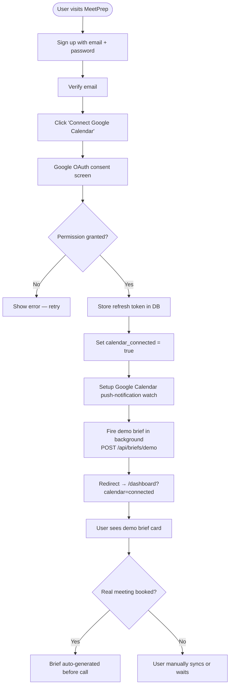
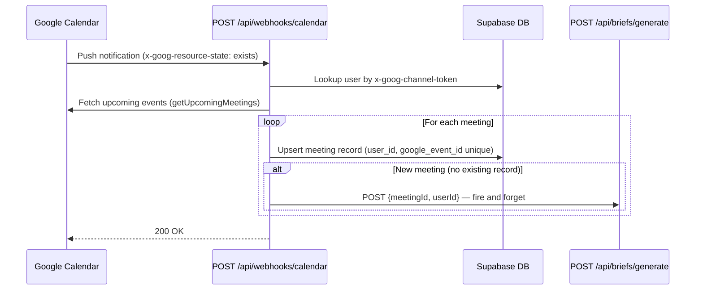
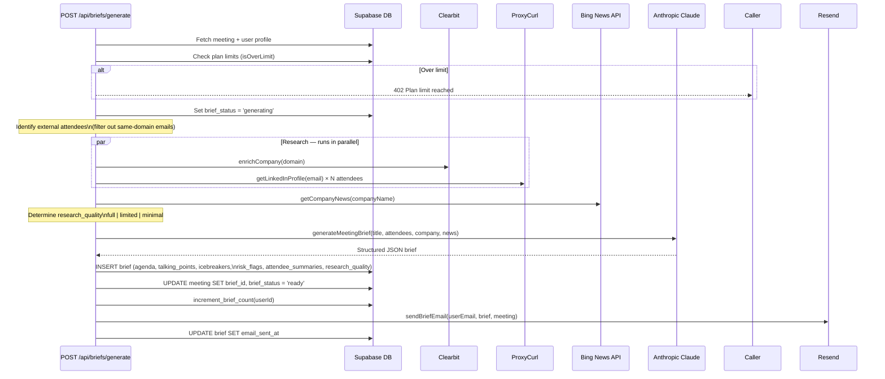
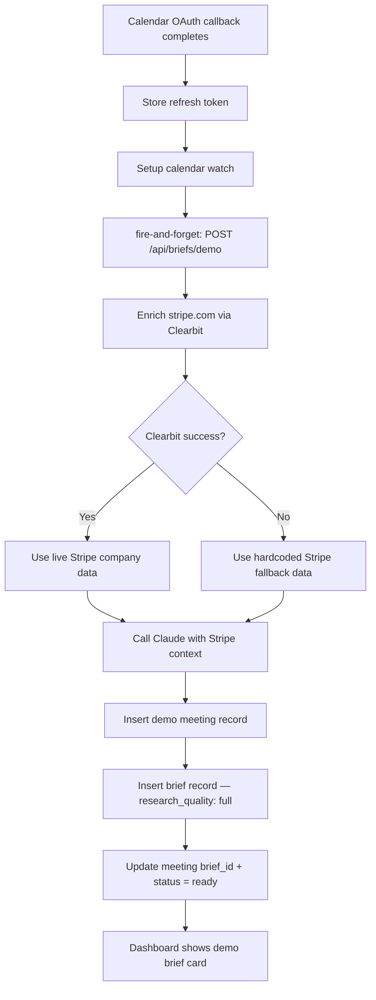
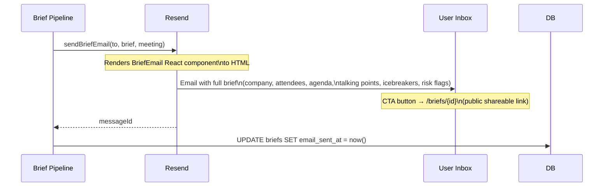
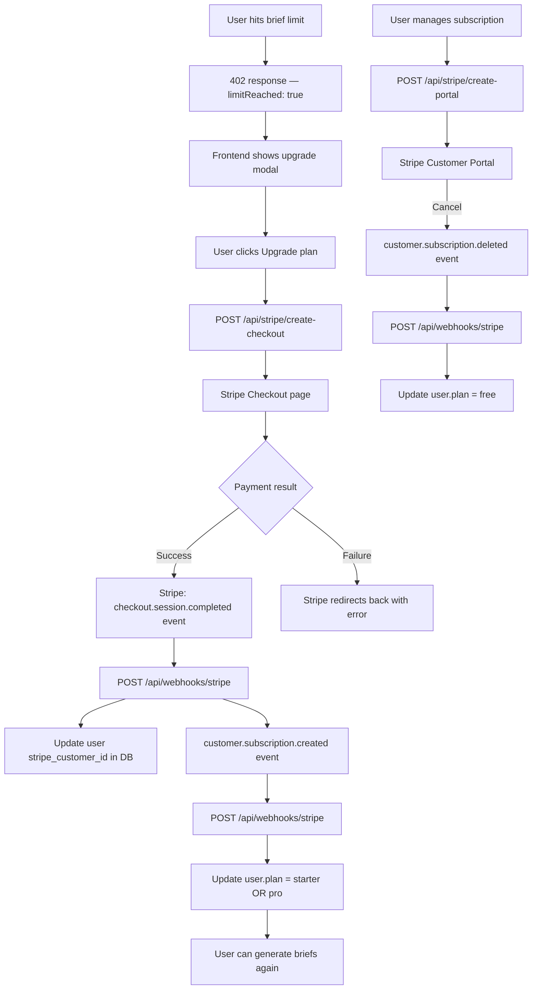
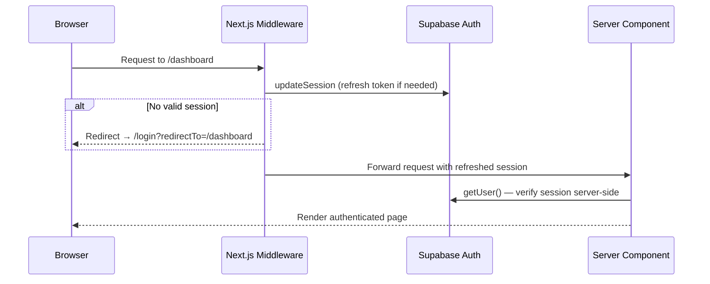

# Process Flows

All major flows in MeetPrep are documented below using sequence and flowchart diagrams.

---

## 1. User Onboarding Flow

---

## 2. Meeting Ingestion Flow

Triggered whenever Google Calendar sends a push notification to the webhook.

---

## 3. Brief Generation Pipeline

The core intelligence layer. Runs as a background call from the webhook handler.

---

## 4. Demo Brief Flow

Fires automatically on first calendar connect. Provides immediate value before any real meeting is booked.

---

## 5. Email Delivery Flow

---

## 6. Stripe Billing Flow

---

## 7. Authentication Flow

