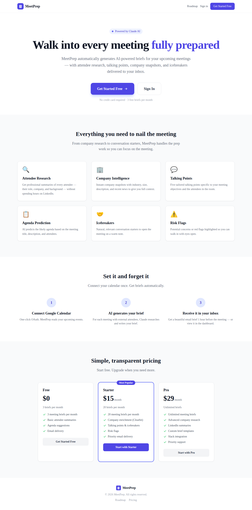
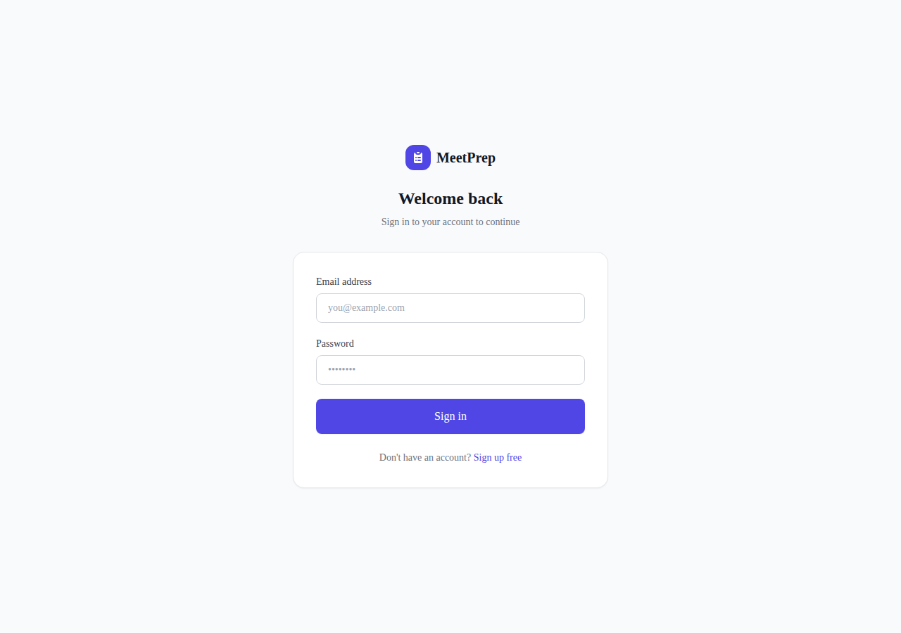
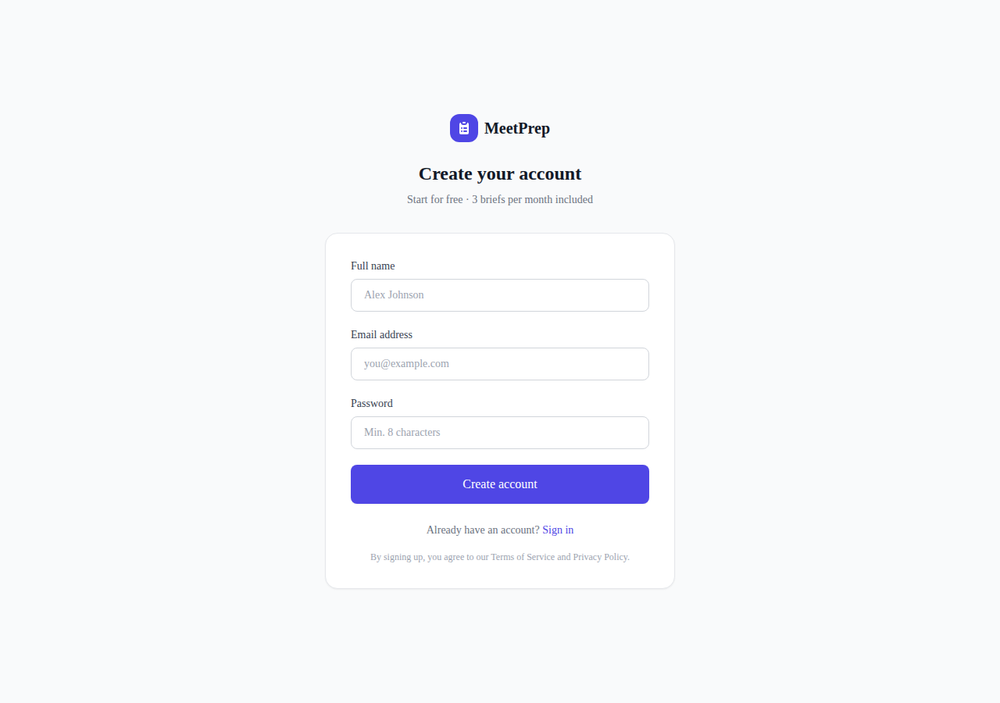
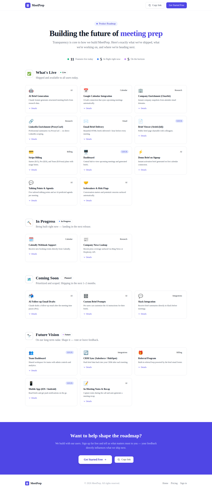

# MeetPrep — Screenshots

Screenshots of the MeetPrep application captured from a running local development instance.

---

## 01 · Landing Page

The public marketing page shown to unauthenticated visitors. Highlights the core value prop, feature cards, how-it-works steps, and pricing tiers.

---

## 02 · Login

Sign-in form. Accepts email/password credentials via Supabase Auth.

---

## 03 · Sign Up

New-account registration form. Free plan — no credit card required.

---

## 04 · Dashboard

Main authenticated view. Lists upcoming meetings and the generation status of each brief (Pending · Generating · Brief Ready · Failed).

---

## 05 · Settings

User account settings: calendar connection, Calendly webhook, notification email, brief timing, custom prompt (Pro), and subscription management.

---

## 06 · Roadmap

Public product roadmap page showing planned and in-progress features.

---

## 07 · Vision Board

Internal vision board page.

