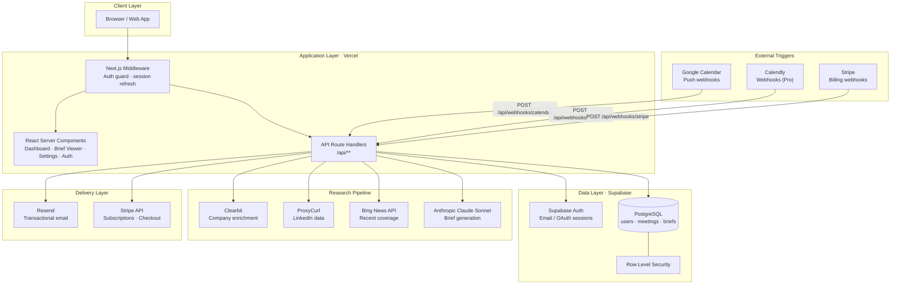

# Technical Architecture

## Overview

MeetPrep is a Next.js 14 App Router application deployed on Vercel, backed by Supabase (Postgres + Auth). When a calendar event is detected, a research pipeline runs in the background — enriching company data, fetching LinkedIn profiles, pulling news, and calling Claude to produce a structured brief — then delivers it by email via Resend.

---

## System Architecture Diagram



---

## Technology Stack

| Layer | Technology | Notes |
|---|---|---|
| Framework | Next.js 14 (App Router) | React Server Components throughout |
| Language | TypeScript | Strict mode |
| Styling | Tailwind CSS | Utility-first; no component library |
| Auth | Supabase Auth | Email/password; Google OAuth for calendar |
| Database | Postgres via Supabase | RLS enforced on all tables |
| Background jobs | Fetch fire-and-forget (v1) | Migrate to Inngest/Trigger.dev at scale |
| Email sending | Resend + React Email | HTML email template built with `@react-email` |
| Billing | Stripe | Checkout + Customer Portal + Webhooks |
| AI brief generation | Anthropic Claude Sonnet 4.6 | ~$0.08/brief at current rates |
| Company enrichment | Clearbit | Domain → company profile |
| LinkedIn data | ProxyCurl via RapidAPI | ~$0.01/lookup; never scrape directly |
| News lookup | Bing News API | Recent company coverage |
| Calendar integration | Google Calendar API | Push notifications via watch channels |
| Deployment | Vercel | Edge middleware; serverless functions |

---

## Directory Structure

```
meetprep/
├── src/
│   ├── app/
│   │   ├── (auth)/            # Login / signup pages
│   │   ├── (dashboard)/       # Authenticated app shell (sidebar + header)
│   │   │   ├── dashboard/     # Meetings list
│   │   │   ├── settings/      # Calendar, billing, preferences
│   │   │   └── briefs/[id]/   # Redirects → public /briefs/[id]
│   │   ├── briefs/[id]/       # Public brief viewer (no auth required)
│   │   └── api/
│   │       ├── auth/          # Supabase auth callback
│   │       ├── briefs/
│   │       │   ├── [id]/      # GET brief by ID (public)
│   │       │   ├── demo/      # POST generate demo brief
│   │       │   └── generate/  # POST run research pipeline + Claude
│   │       ├── calendar/
│   │       │   ├── callback/  # Google OAuth callback
│   │       │   ├── connect/   # Initiate Google OAuth
│   │       │   └── sync/      # Manual calendar sync
│   │       ├── demo/          # 308 redirect → /api/briefs/demo
│   │       ├── stripe/
│   │       │   ├── create-checkout/
│   │       │   └── create-portal/
│   │       └── webhooks/
│   │           ├── calendar/  # Google Calendar push notifications
│   │           └── stripe/    # Stripe billing events
│   ├── components/
│   │   ├── briefs/            # BriefCard, BriefViewer
│   │   ├── layout/            # Header, Sidebar
│   │   ├── meetings/          # MeetingCard, MeetingList, GenerateBriefButton
│   │   └── ui/                # Badge, Button, Card, Spinner
│   ├── emails/
│   │   └── BriefEmail.tsx     # React Email template
│   ├── lib/
│   │   ├── anthropic.ts       # Claude brief generation
│   │   ├── calendar.ts        # Google Calendar API helpers
│   │   ├── clearbit.ts        # Company enrichment
│   │   ├── news.ts            # Bing News API
│   │   ├── proxycurl.ts       # LinkedIn lookup
│   │   ├── resend.ts          # Email delivery
│   │   ├── stripe.ts          # Stripe helpers
│   │   ├── supabase/          # Server / client / middleware Supabase clients
│   │   └── utils.ts           # Shared utilities
│   ├── tests/                 # Vitest unit tests
│   ├── middleware.ts           # Auth guard + session refresh
│   └── types/
│       └── index.ts           # Shared TypeScript types
├── supabase/
│   └── schema.sql             # Full DB schema with RLS
├── docs/                      # All project documentation
├── scripts/
│   └── generate-api-docs.js   # Auto-generates docs/api-reference.md
└── .github/
    └── workflows/
        ├── docs-check.yml     # PR guardrail: block merge without docs update
        └── docs-generate.yml  # Auto-regenerate API reference on push
```

---

## Key Architectural Decisions

### Why no background job framework (yet)?
In v1, brief generation is triggered via `fetch` fire-and-forget from the calendar webhook handler. This keeps the stack simple. The right migration point is when:
- Brief generation regularly exceeds the Vercel function timeout (30s on Pro), or
- Retry/observability needs grow.

At that point, replace fire-and-forget calls with **Inngest** or **Trigger.dev** event publishing.

### Why public RLS on briefs and meetings?
`/briefs/{id}` must be shareable without login. Brief and meeting IDs are UUIDs (128-bit) — they cannot be brute-forced. The public SELECT RLS policy intentionally allows any request with a valid ID to read the record.

### Why ProxyCurl instead of scraping LinkedIn?
LinkedIn's terms of service prohibit automated scraping. ProxyCurl acts as a compliant data intermediary. Cost is ~$0.01/lookup, well within the $0.08/brief gross margin target.

### Why is the dashboard brief page a redirect?
The URL `/briefs/{id}` is owned by the public page (`src/app/briefs/[id]`). The `(dashboard)` route group cannot occupy the same URL. Instead of duplicating the view, the dashboard brief page redirects to the canonical public URL, which works for both authenticated and anonymous visitors.

---

## Security Considerations

| Concern | Mitigation |
|---|---|
| Unauthenticated data access | RLS on all tables; public SELECT only on briefs/meetings by UUID |
| Webhook spoofing (Google) | `x-goog-channel-token` validated against stored userId |
| Webhook spoofing (Stripe) | `stripe-signature` HMAC verified with `STRIPE_WEBHOOK_SECRET` |
| Brief generation by non-owners | `userId` always validated against the meeting's `user_id` |
| Overage billing | `isOverLimit()` checked before every brief generation |
| LinkedIn scraping liability | ProxyCurl API only — no direct scraping |
| Secret leakage | All secrets in env vars; never committed to repo |
